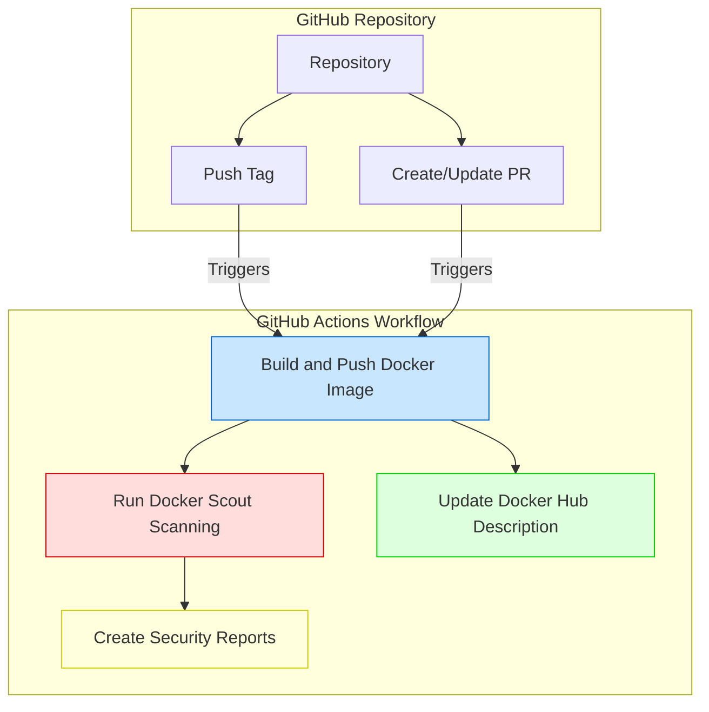
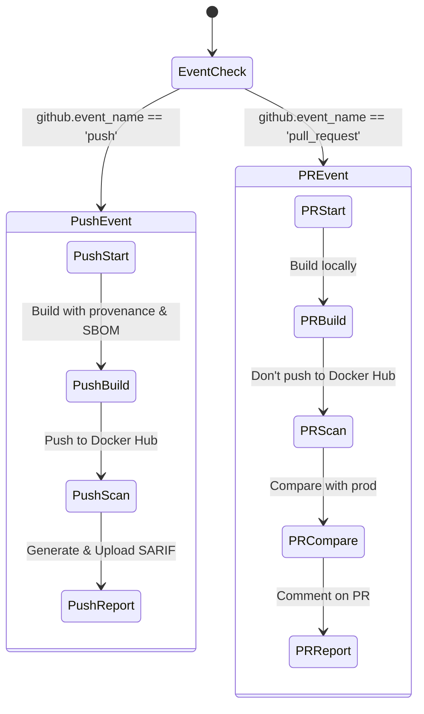
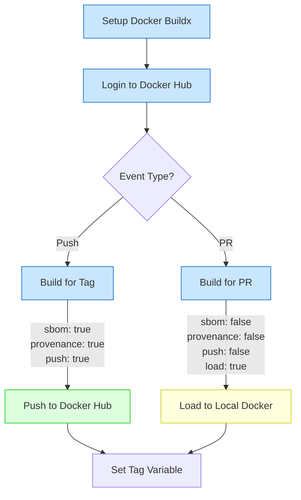
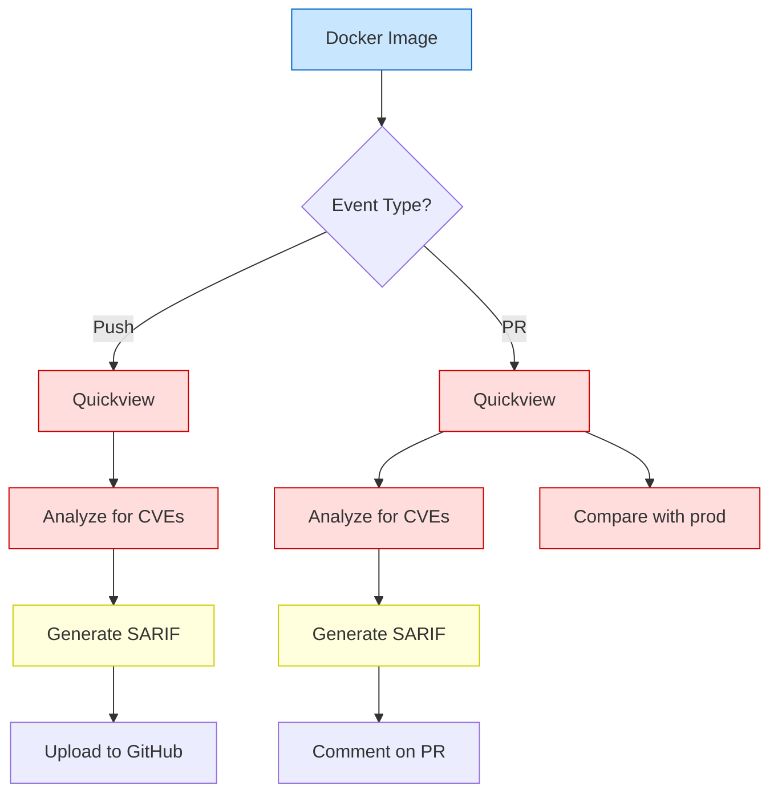
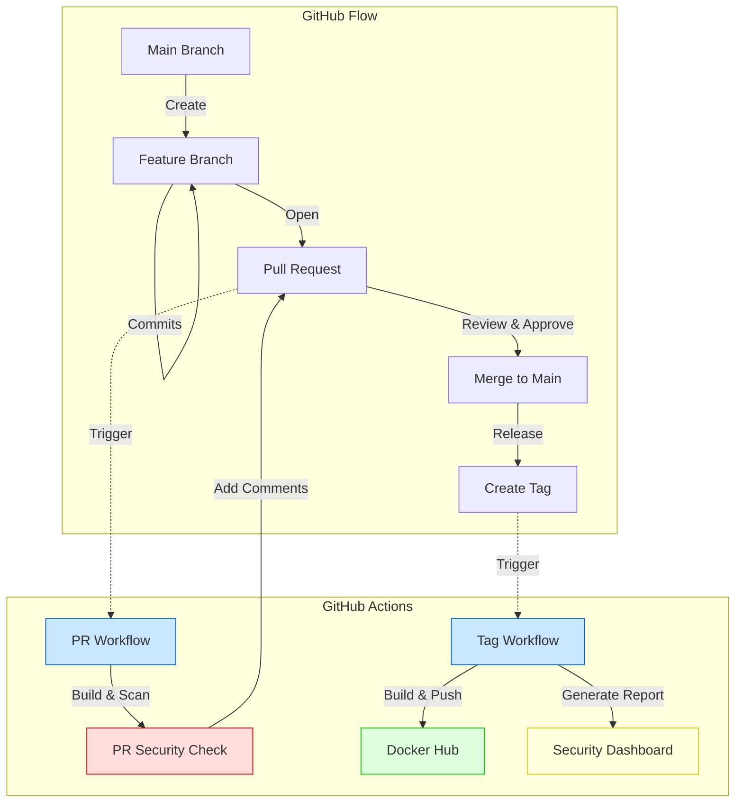
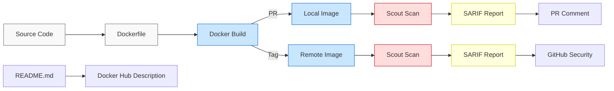

# Docker Build + Scout with GitHub Action

The GitHub Actions workflow is designed to build Docker images, scan them for vulnerabilities using Docker Scout, and update the Docker Hub repository description. Below is an explanation of each Docker-related step:

---

### **Setup Docker buildx**
```yaml
- name: Setup Docker buildx
  uses: docker/setup-buildx-action@v3
```
- **Purpose**: Sets up Docker Buildx, a CLI plugin that extends Docker's build capabilities. Buildx enables advanced features like multi-platform builds, caching, and exporting build results.
- **Why**: Required for building and pushing Docker images with advanced features.

---

### **Log in to Docker Hub**
```yaml
- name: 🐳 Log in to Docker Hub
  uses: docker/login-action@v3
  with:
    username: ${{ secrets.DOCKER_USERNAME }}
    password: ${{ secrets.DOCKER_PASSWORD }}
```
- **Purpose**: Logs into Docker Hub using credentials stored in GitHub Secrets.
- **Why**: Necessary to push Docker images to Docker Hub or pull private images.

---

### **Build and push Docker image on push**
```yaml
- name: 📦 Build and push Docker image on push
  if: github.event_name == 'push'
  uses: docker/build-push-action@v6
  with:
    context: .
    file: ./Dockerfile
    load: false
    push: true
    tags: ${{ env.DOCKER_NAMESPACE }}/${{ env.DOCKER_IMAGE_NAME }}:${{ github.ref_name }}
    sbom: true
    provenance: true
```
- **Purpose**: Builds and pushes a Docker image to Docker Hub when a tag is pushed.
- **Key Features**:
  - `context`: Specifies the build context (current directory).
  - `file`: Specifies the Dockerfile to use.
  - `load: false`: Does not load the image into the local Docker daemon.
  - `push: true`: Pushes the image to Docker Hub.
  - `tags`: Tags the image with the Git reference name (e.g., the tag name).
  - `sbom: true`: Generates a Software Bill of Materials (SBOM) for the image.
  - `provenance: true`: Adds provenance attestations for the image.
- **Why**: Automates the process of building and publishing Docker images for tagged releases.

---

### **Build and push Docker image on PR**
```yaml
- name: 🎁 Build and push Docker image on PR
  if: github.event_name == 'pull_request'
  uses: docker/build-push-action@v6
  with:
    context: .
    file: ./Dockerfile
    load: true
    push: false
    tags: ${{ env.DOCKER_NAMESPACE }}/${{ env.DOCKER_IMAGE_NAME }}:pr-${{ github.event.number }}
    sbom: false
    provenance: false
```
- **Purpose**: Builds a Docker image for pull requests but does not push it to Docker Hub.
- **Key Features**:
  - `load: true`: Loads the image into the local Docker daemon for testing.
  - `push: false`: Does not push the image to Docker Hub.
  - `tags`: Tags the image with the pull request number.
  - `sbom: false` and `provenance: false`: Disables SBOM and provenance generation for PR builds.
- **Why**: Allows testing of Docker images in pull requests without publishing them.

---

### **Set Docker image name variable**
```yaml
- name: 🏷️ Set Docker image name variable
  id: image-name
  run: |
    if [ "${{ github.event_name }}" = "push" ]; then
      echo "FULL_IMAGE_NAME=${{ env.DOCKER_NAMESPACE }}/${{ env.DOCKER_IMAGE_NAME }}:${{ github.ref_name }}" >> $GITHUB_ENV
    else
      echo "FULL_IMAGE_NAME=${{ env.DOCKER_NAMESPACE }}/${{ env.DOCKER_IMAGE_NAME }}:pr-${{ github.event.number }}" >> $GITHUB_ENV
```
- **Purpose**: Sets the `FULL_IMAGE_NAME` environment variable based on the event type (push or pull request).
- **Why**: Ensures the correct image name is used in subsequent steps.

---

### **Run Scout scan on PR**
```yaml
- name: 🔍🤔 Run Scout scan on PR
  if: github.event_name == 'pull_request'
  uses: docker/scout-action@v1
  with:
    command: quickview
    image: ${{ steps.image-name.outputs.FULL_IMAGE_NAME }}
```
- **Purpose**: Runs a quick vulnerability scan on the Docker image for pull requests using Docker Scout.
- **Why**: Provides an overview of vulnerabilities in the image.

---

### **Compare to deployed image**
```yaml
- name: 👀🤔 Compare to deployed image
  id: docker-scout-compare
  if: ${{ github.event_name == 'pull_request_target' }}
  uses: docker/scout-action@main
  with:
    command: compare
    image: ${{ steps.image-name.outputs.FULL_IMAGE_NAME }}
    only-severities: critical,high
    to-env: prod
    exit-code: true       
    summary: true
```
- **Purpose**: Compares the current image to the deployed image in the `prod` environment, focusing on critical and high vulnerabilities.
- **Why**: Ensures that the new image does not introduce additional vulnerabilities.

---

### **Analyze PR for CVEs**
```yaml
- name: 🚨 Analyze PR for CVEs
  if: github.event_name == 'pull_request'
  uses: docker/scout-action@v1
  with:
    command: cves
    image: ${{ steps.image-name.outputs.FULL_IMAGE_NAME }}
    only-severities: critical,high
    exit-code: true
    sarif-file: ${{ env.SARIF_FILE }}
```
- **Purpose**: Analyzes the Docker image for critical and high Common Vulnerabilities and Exposures (CVEs) and generates a SARIF report.
- **Why**: Identifies security issues in the image before merging the pull request.

---

### **Comment PR with Scout results**
```yaml
- name: 💬 Comment PR with Scout results
  if: github.event_name == 'pull_request'
  uses: docker/scout-action@v1
  with:
    command: cves
    image: ${{ steps.image-name.outputs.FULL_IMAGE_NAME }}
    only-severities: critical,high
    summary: true
    write-comment: true
```
- **Purpose**: Comments on the pull request with a summary of the CVE analysis.
- **Why**: Provides visibility into vulnerabilities directly in the pull request.

---

### **Run Scout scan on tag**
```yaml
- name: 🔍 Run Scout scan on tag
  if: github.event_name == 'push'
  uses: docker/scout-action@v1
  with:
    command: quickview
    image: ${{ steps.image-name.outputs.FULL_IMAGE_NAME }}
```
- **Purpose**: Runs a quick vulnerability scan on the Docker image for tagged releases.
- **Why**: Ensures the image is secure before publishing.

---

### **Analyze for critical and high CVEs**
```yaml
- name: 🐞 Analyze for critical and high CVEs
  id: docker-scout-cves
  if: github.event_name == 'push'
  uses: docker/scout-action@v1
  with:
    command: cves
    image: ${{ steps.image-name.outputs.FULL_IMAGE_NAME }}
    sarif-file: ${{ env.SARIF_FILE }}
    summary: true
```
- **Purpose**: Analyzes the Docker image for critical and high CVEs and generates a SARIF report.
- **Why**: Ensures the image is secure before publishing.

---

### **Upload Scout Report**
```yaml
- name: 📝 Upload Scout Report
  id: upload-sarif
  if: github.event_name == 'push'
  uses: github/codeql-action/upload-sarif@v3
  with:
    sarif_file: ${{ env.SARIF_FILE }}
```
- **Purpose**: Uploads the SARIF report to GitHub for further analysis.
- **Why**: Integrates vulnerability data into GitHub's security features.

---

### **Update Docker Hub Description**
```yaml
- name: 📝 Update Docker Hub Description
  uses: peter-evans/dockerhub-description@v3
  with:
    username: ${{ secrets.DOCKER_USERNAME }}
    password: ${{ secrets.DOCKER_PASSWORD }}
    repository: ${{ env.DOCKER_NAMESPACE }}/${{ env.DOCKER_IMAGE_NAME }}
    short-description: "Demo application for GitHub Actions & Docker integration"
    readme-filepath: ./README.md
```
- **Purpose**: Updates the Docker Hub repository description and README.
- **Why**: Keeps the Docker Hub repository information up-to-date.

--- 

This workflow automates Docker image building, scanning, and publishing while ensuring security and providing visibility into vulnerabilities.

## Docker Build and Scout GitHub Actions Workflow Diagrams

### 1. Overall Workflow Trigger Flow

This diagram shows when and how the workflow is triggered based on GitHub events:



### 2. Branching Logic by Event Type

This diagram shows how the workflow handles different event types:



### 3. Docker Build Process Details

This diagram shows the details of the Docker build process:



### 4. Docker Scout Security Scanning Flow

This diagram shows how Docker Scout scanning is performed:



### 5. Integration with GitHub Flow

This diagram shows how the workflow integrates with the GitHub Flow development process:



### 6. Data Flow in the Workflow

This diagram shows how data flows through the workflow:

