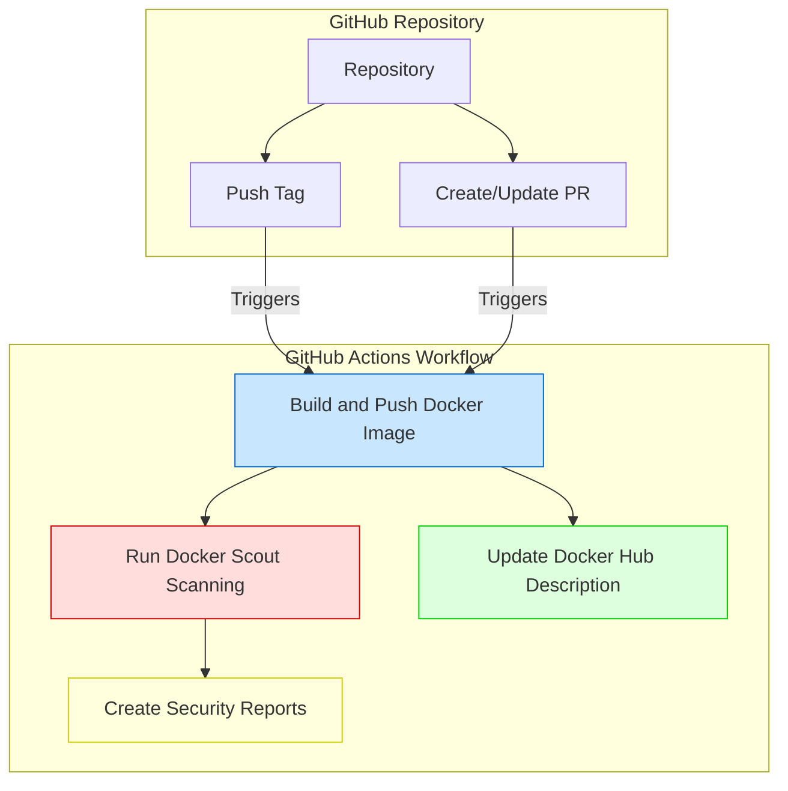
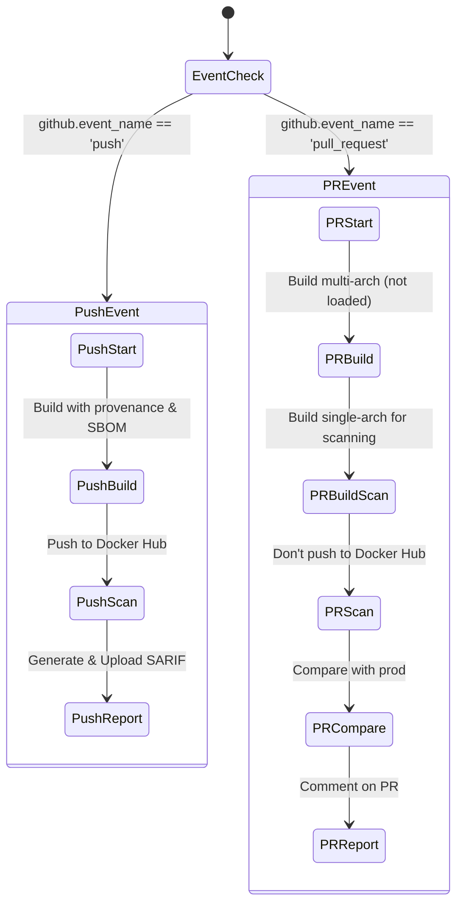
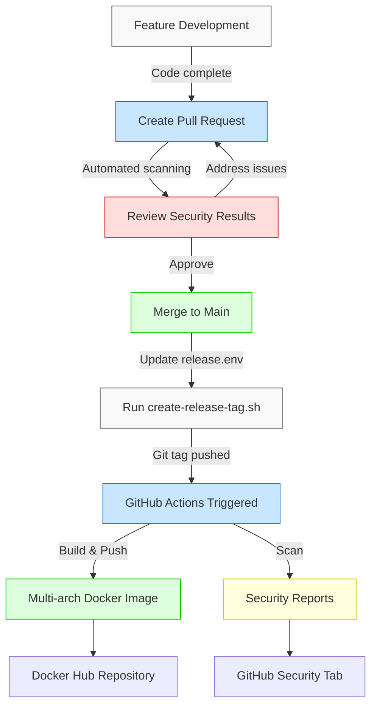
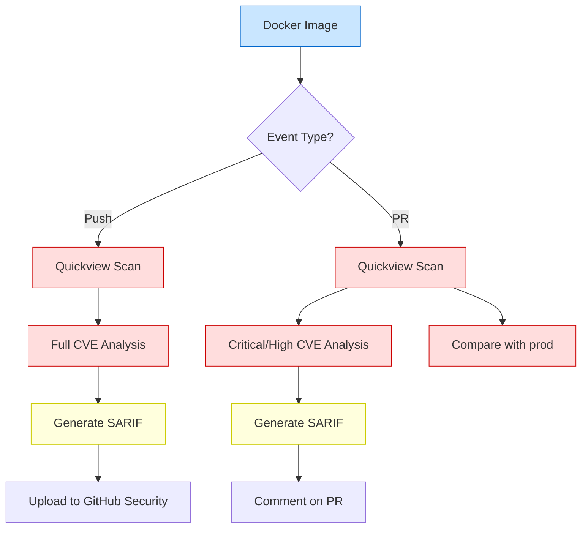

# GitHub Action & Developer Workflow Explanation

## GitHub Actions Workflow

The GitHub Actions workflow in your project (`docker-build.yml`) automates Docker image building, vulnerability scanning, and publishing. It's triggered by two events:

1. **Push events with tags** - When you push a tag to the repository
2. **Pull requests** to the main branch - When PRs are opened or updated

### Key Steps in the Workflow

1. **Setup Environment**
   - Checks out code
   - Sets up QEMU for multi-architecture builds (amd64 and arm64)
   - Configures Docker Buildx for advanced build capabilities
   - Authenticates with Docker Hub

2. **Build and Push Image** (for tags/releases)
   - Builds multi-platform Docker image (amd64 and arm64)
   - Pushes to Docker Hub with the tag name
   - Generates SBOM (Software Bill of Materials) and provenance

3. **Build Image for PRs** (without pushing)
   - Builds multi-platform image but doesn't push to registry
   - Creates a single-platform (amd64) image for scanning

4. **Security Scanning with Docker Scout**
   - For PRs:
     - Quick vulnerability scan
     - Detailed CVE analysis (critical and high severity)
     - Adds scan results as PR comments
   - For tags:
     - Quick vulnerability scan
     - Comprehensive CVE analysis
     - Generates SARIF security report

5. **Report Handling**
   - Uploads SARIF report to GitHub Security tab
   - Updates Docker Hub repository description

### Conditional Execution

The workflow uses conditions to determine which steps run:
- `if: github.event_name == 'push'` for tag-related steps
- `if: github.event_name == 'pull_request'` for PR-related steps

## Developer Workflow

Based on your project files, the developer workflow appears to be:

1. **Development Phase**
   - Develop code on feature branches
   - Make changes to the application (Go application in this case)

2. **Pull Request Phase**
   - Create a PR to merge changes to main
   - GitHub Actions builds the image without pushing
   - Docker Scout scans for vulnerabilities
   - PR receives automated comments with scan results
   - Review and address any security issues

3. **Release Phase**
   - After PR is merged, create a release tag using `create-release-tag.sh`
   - The script sets the version in `release.env`, commits, and pushes the tag
   - GitHub Actions builds and pushes the image to Docker Hub
   - Docker Scout performs comprehensive scanning
   - SARIF report is uploaded to GitHub Security

4. **Maintenance**
   - If needed, remove a tag using `remove-release-tag.sh`

## Workflow Diagrams

### 1. Overall Workflow Trigger Flow

### 2. Docker Build Process by Event Type

### 3. Developer Release Workflow

### 4. Docker Scout Security Scanning Flow

## Key Highlights

1. **Automated Security Integration**
   - Docker Scout is integrated at multiple points in the workflow
   - Security scanning happens automatically for both PRs and releases
   - Results are integrated into the PR review process

2. **Multi-Platform Support**
   - The workflow builds for both amd64 and arm64 architectures
   - Special handling for PR scanning (single-arch image for scanning)

3. **Different Handling for PRs vs Releases**
   - PRs: Build but don't push; focus on security scanning
   - Releases: Build, scan, and push with full metadata (SBOM and provenance)

4. **Developer-Friendly Tools**
   - Helper scripts (`create-release-tag.sh`, `remove-release-tag.sh`)
   - Automatic PR comments with security insights
   - Documentation in README and docs directory

This CI/CD setup provides a robust workflow for Docker image building, security scanning, and publishing that balances development speed with security best practices.